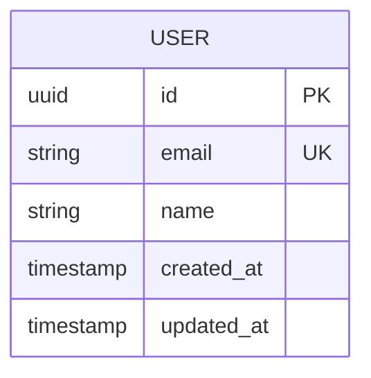

# {{name}} — Database Schema

> Generated by Devran AI Kit Onboarding Engine

## Overview

**Project:** {{name}}
**Database:** *As defined in TECH-STACK-ANALYSIS.md*

## Entity Relationship Diagram

*Expand with project-specific entities after PRD feature definition.*

<!-- IF:hasAuth -->
## Authentication Tables

| Table | Purpose | Key Fields |
|-------|---------|-----------|
| users | User accounts | id, email, password_hash, role |
| sessions | Active sessions | id, user_id, token, expires_at |
<!-- ENDIF:hasAuth -->

## Core Domain Tables

| Table | Purpose | Key Fields |
|-------|---------|-----------|
| *TBD from PRD features* | | |

## Indexes

| Table | Index | Type | Rationale |
|-------|-------|------|-----------|
| users | email | UNIQUE | Login lookup |

## Migration Strategy

- Sequential numbered migrations
- Each migration is reversible (up/down)
- Never modify existing migrations — create new ones
- Test migrations against production-like data volumes

## Data Privacy

<!-- IF:hasCompliance -->
Compliance requirements: {{auth.compliance}}
<!-- ENDIF:hasCompliance -->

- PII fields must be identified and documented
- Data retention policies defined per table
- Deletion cascades reviewed for GDPR right-to-erasure

## Next Steps

- [ ] Define entities from PRD.md core features
- [ ] Create initial migration files
- [ ] Set up seed data for development
