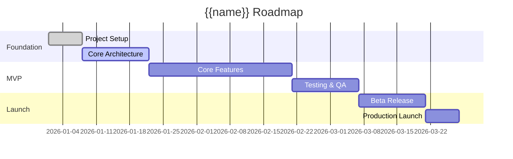

# {{name}} — Product Roadmap

> Generated by Devran AI Kit Onboarding Engine

## Overview

**Project:** {{name}}
**MVP Deadline:** {{timeline.mvpDeadline}}
**Full Launch:** {{timeline.fullLaunch}}

## Milestone Overview

## Phase 1: Foundation (Weeks 1-3)

| Deliverable | Priority | Dependencies | Estimation |
|------------|----------|-------------|------------|
| Project scaffolding | P0 | None | 1 sprint |
| Database schema | P0 | Architecture | 1 sprint |
| Auth system | P0 | Database | 1 sprint |
<!-- IF:hasApi -->
| API foundation | P0 | Architecture | 1 sprint |
<!-- ENDIF:hasApi -->

## Phase 2: MVP Features (Weeks 4-8)

| Deliverable | Priority | Dependencies | Estimation |
|------------|----------|-------------|------------|
| *From PRD.md P0 features* | P0 | Phase 1 | *TBD* |

## Phase 3: Polish & Testing (Weeks 9-10)

| Deliverable | Priority | Dependencies | Estimation |
|------------|----------|-------------|------------|
| Integration testing | P0 | Phase 2 | 1 sprint |
| Performance optimization | P1 | Phase 2 | 1 sprint |
| Security audit | P0 | Phase 2 | 0.5 sprint |

## Phase 4: Launch (Weeks 11-12)

| Deliverable | Priority | Dependencies | Estimation |
|------------|----------|-------------|------------|
| Beta testing | P0 | Phase 3 | 1 sprint |
| Production deployment | P0 | Beta | 0.5 sprint |
| Monitoring setup | P0 | Deployment | 0.5 sprint |

## Post-Launch

- User feedback collection
- Performance monitoring
- Feature iteration based on data

## Risk Register

| Risk | Probability | Impact | Mitigation |
|------|------------|--------|-----------|
| Scope creep | High | High | Strict MVP definition |
| Tech debt | Medium | Medium | Refactor sprints |
| Third-party API changes | Low | High | Abstraction layers |

Refer to SPRINT-PLAN.md for detailed sprint breakdown and PRD.md for feature definitions.

## Next Steps

- [ ] Validate timeline with team capacity
- [ ] Identify critical path dependencies
- [ ] Set up milestone tracking
