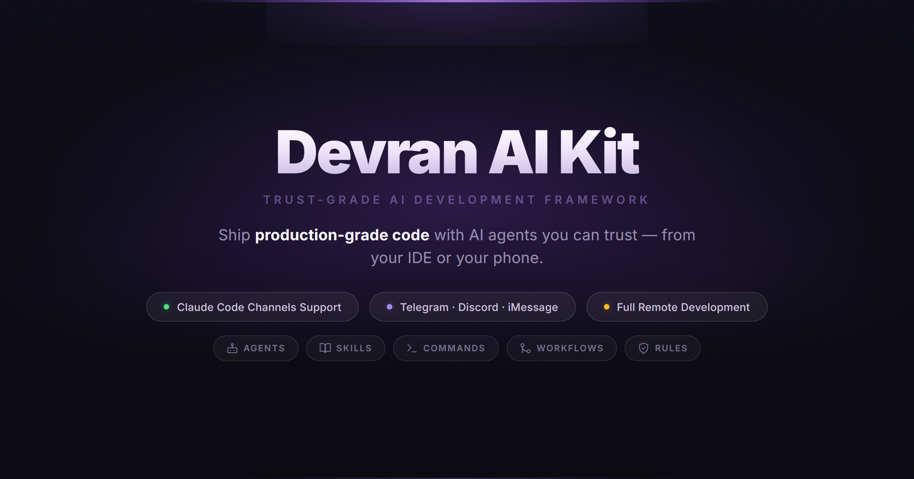

# Devran AI Kit

<p align="center">
  <a href="https://devran-ai.github.io/kit/">
    
  </a>
</p>

<p align="center">
  <a href="https://github.com/devran-ai/kit"></a>
  <a href="LICENSE"></a>
  <a href="tests/"></a>
  <a href="package.json"></a>
  <a href=".agent/agents/"></a>
  <a href=".agent/skills/"></a>
</p>

> Trust-Grade AI Development Framework — Zero dependencies. 23 agents. 35 skills. 22 workflows. One command.

## Why Devran AI Kit?

- **Not a prompt collection** — 34-module zero-dependency runtime engine with workflow state machine, circuit breaker, error budget, and self-healing CI
- **Trust-grade governance** — Immutable operating constraints enforced through a 7-phase SDLC (IDLE > EXPLORE > PLAN > IMPLEMENT > VERIFY > CHECKPOINT > REVIEW > DEPLOY)
- **Intelligent agent system** — 23 specialized agents with reputation scoring, domain-aware routing, and on-demand loading via keyword matching
- **Telegram integration** — Control your Claude Code session from your phone. Trigger workflows, review PRs, and deploy — all from a Telegram chat
- **Cross-IDE support** — One `kit init` configures Claude Code, Antigravity, Cursor, OpenCode, and Codex from a single manifest source of truth

## Comparison

| Capability | Prompt Files | Rule Collections | **Devran AI Kit** |
|---|---|---|---|
| Agent orchestration | Manual | Manual | 23 agents with reputation scoring |
| Workflow governance | None | None | 7-phase SDLC state machine |
| Session persistence | None | None | Full state across restarts |
| Self-healing CI | None | None | Auto-diagnoses and patches failures |
| Cross-IDE support | Single IDE | Single IDE | 5 IDEs from one source of truth |
| Plugin marketplace | None | None | Trust-verified skill marketplace |
| Telegram control | None | None | Full IDE control from your phone |
| Test suite | None | None | 568 tests with security validation |
| Runtime dependencies | Varies | Varies | **Zero** |

## Quick Start

### Option 1: Create New Project (Recommended)

```bash
npx create-kit-app my-project
npx create-kit-app my-api --template node-api
npx create-kit-app my-app --template nextjs
```

Creates a new project with `.agent/` pre-configured. Templates: `minimal`, `node-api`, `nextjs`.

### Option 2: Add to Existing Project

```bash
npx @devran-ai/kit init
```

## How It Works in Teams

Devran AI Kit is **personal developer tooling** — like your IDE settings. `kit init` adds `.agent/` to `.gitignore` by default so it stays local.

| Mode | Command | Behavior |
|------|---------|----------|
| Personal (default) | `kit init` | `.agent/` gitignored — local only |
| Team (opt-in) | `kit init --shared` | `.agent/` committed — shared with team |

Your project's `CLAUDE.md` remains the single source of truth. The kit enhances your personal workflow without affecting teammates. Anyone who wants it runs `npx @devran-ai/kit init`.

### Updating

```bash
kit update              # Non-destructive — preserves your customizations
kit update --dry-run    # Preview changes without applying
```

> Prefer `kit update` over `kit init --force`. The update command preserves your session data, ADRs, learning contexts, and customizations. Use `init --force` only for clean reinstalls.

### Verify Installation

```bash
kit verify    # Manifest integrity check
kit scan      # Security scan
```

## Architecture

| Component | Count | Purpose |
|---|---|---|
| Agents | 23 | Specialized AI agents with reputation scoring and domain routing |
| Skills | 35 | Domain knowledge modules loaded on demand via keyword matching |
| Commands | 37 | Slash commands for IDE interaction (`/plan`, `/implement`, `/verify`) |
| Workflows | 22 | Process templates with quality gates and phase enforcement |
| Runtime Modules | 33 | Engine components (state machine, circuit breaker, plugin system) |
| Rules | 10 | Governance constraints (security, coding style, testing, git) |
| Checklists | 4 | Verification checklists (pre-commit, deployment, review, release) |
| Hooks | 8 | Lifecycle events (session start/end, phase transition, task complete) |

### Workflow State Machine

```
IDLE -> EXPLORE -> PLAN -> IMPLEMENT -> VERIFY -> CHECKPOINT -> REVIEW -> DEPLOY
```

Each phase requires explicit developer approval before transitioning. The engine enforces governance rules and tracks session state across restarts.

## What's New

See the full **[CHANGELOG](CHANGELOG.md)** for detailed release notes.

**Latest (v4.6.0):** Production-grade audit — immutable state patterns across all stateful modules, structured error logging, path traversal defense, credential leak prevention, documentation consolidation.

## Cross-IDE Support

| IDE | Config Path | Format |
|---|---|---|
| Claude Code | `.agent/` | Native |
| Antigravity | `.agent/` | Native |
| Cursor | `.cursor/rules/` | YAML frontmatter + Markdown |
| OpenCode | `.opencode/` | JSON |
| Codex | `.codex/` | TOML |

All generated automatically by `kit init`.

## CLI Reference

| Command | Description | Key Flags |
|---|---|---|
| `kit init` | Install `.agent/` framework into project | `--force`, `--path <dir>` |
| `kit update` | Non-destructive framework update | `--dry-run` |
| `kit status` | Dashboard with capabilities and metrics | — |
| `kit verify` | Manifest integrity and structure checks | — |
| `kit scan` | Security scan (secrets, injection patterns) | — |
| `kit plugin` | Plugin management | `list`, `install`, `remove` |
| `kit market` | Marketplace integration | `search`, `info`, `install` |
| `kit heal` | CI failure detection and auto-fix | `--file <path>`, `--apply` |
| `kit health` | Aggregated health check | — |
| `kit sync-bot-commands` | Sync workflows to Telegram bot menu (all scopes) | `--scope`, `--token`, `--dry-run`, `--clear`, `--limit`, `--source`, `--guard`, `--install-guard` |

## Safety Guarantees

Devran AI Kit is designed to **never touch your project files**. All operations are scoped to the `.agent/` directory.

| Your Project Files | Safe? | Details |
|---|---|---|
| Source code (`src/`, `lib/`, `app/`) | Never touched | Init/update only operates on `.agent/` |
| Config files (`.env`, `package.json`) | Never touched | No project config is read or written |
| Documentation (`docs/`, `README.md`) | Never touched | Only `.agent/` docs are managed |
| Tests (`tests/`, `__tests__/`) | Never touched | Kit tests are internal to the package |
| Platform files (`android/`, `ios/`) | Never touched | No platform-specific operations |

`init --force` safety features:

- **Auto-backup** — Creates timestamped backup of existing `.agent/` before overwriting
- **Atomic copy** — Uses temp directory + rename to prevent corruption on failure
- **Symlink guard** — Skips symbolic links to prevent path traversal attacks
- **Session warning** — Alerts if active work-in-progress would be destroyed
- **Dry-run preview** — `--dry-run --force` shows exactly which user files would be overwritten

`update` preserved files:

- `session-context.md` — Your active session notes
- `session-state.json` — Your session metadata
- `decisions/` — Your Architecture Decision Records
- `contexts/` — Your learning data and plan quality logs
- `rules/` — Your custom governance rules
- `checklists/` — Your custom quality gates

## Agents (23)

| Category | Agents |
|---|---|
| **Core Development** | Architect, Code Reviewer, TDD Guide, Planner |
| **Language Reviewers** | TypeScript Reviewer, Python Reviewer, Go Reviewer |
| **Domain Specialists** | Frontend Specialist, Backend Specialist, Mobile Developer, Database Architect, DevOps Engineer |
| **Quality & Security** | Security Reviewer, E2E Runner, Performance Optimizer, Reliability Engineer |
| **Support & Intelligence** | Doc Updater, Build Error Resolver, Refactor Cleaner, Explorer Agent, Knowledge Agent |
| **Autonomy** | PR Reviewer, Sprint Orchestrator |

## Operating Constraints

| Principle | Description |
|---|---|
| Trust > Optimization | User trust is never sacrificed for metrics |
| Safety > Growth | User safety overrides business goals |
| Explainability > Performance | Understandable AI beats faster AI |
| Completion > Suggestion | Finish current work before proposing new |
| Consistency > Speed | All affected files updated, not just target |

## Repository Structure

```
kit/
├── .agent/                 # Framework directory (installed to projects)
│   ├── agents/             # 23 specialized agent definitions
│   ├── skills/             # 35 domain knowledge modules
│   ├── commands/           # 37 slash command definitions
│   ├── workflows/          # 22 workflow templates
│   ├── rules/              # 10 governance constraints
│   ├── checklists/         # 4 lifecycle quality gates
│   ├── engine/             # Runtime config (loading-rules, MCP templates)
│   ├── decisions/          # Architecture Decision Records
│   └── manifest.json       # Definitive capability inventory
├── lib/                    # 33 runtime modules (zero dependencies)
├── bin/kit.js              # CLI entry point
├── create-kit-app/         # Project scaffolder
├── docs/                   # MkDocs documentation site
├── examples/               # Starter examples (minimal, full-stack)
└── tests/                  # 568 tests (unit, structural, security)
```

## Security

Secret detection covers API keys, tokens, AWS credentials, and private keys. The scanner checks for prompt injection patterns, path traversal attempts, and symlink abuse. Plugins are verified with SHA-256 checksums before installation.

## Telegram Integration

Run your entire development workflow from your phone. Devran AI Kit turns any Telegram chat into a full Claude Code remote control.

```
You (Telegram)  ──>  Bot  ──>  Claude Code  ──>  Bot  ──>  You (Telegram)
```

| What you can do | How |
|---|---|
| Trigger any workflow | Type `/` in the chat — all 22 workflows appear as a native bot menu |
| Plan a feature | `/plan auth system` — bot executes immediately |
| Review a PR | `/pr_review PR #5` — multi-perspective review runs |
| Deploy to production | `/deploy staging` — pre-flight checks + deploy |
| Check project status | `/project_status` — instant overview |
| Debug an issue | `/debug login page crashes on mobile` |

**Smart argument handling** — Send `/plan` alone and the bot asks what you need. Send `/plan auth system` and it executes directly. No extra steps.

**Menu guard** — The bot menu auto-restores on every session. Your 22 workflows are always one tap away.

### Get started

```bash
kit sync-bot-commands                  # Push workflows to bot menu
kit sync-bot-commands --install-guard  # Keep menu persistent across sessions
```

**[Full setup guide](docs/telegram-setup.md)** — Create a bot, install the plugin, pair your account, and start using workflows from Telegram in under 5 minutes.

## Documentation

Full documentation: [devran-ai.github.io/kit](https://devran-ai.github.io/kit/)

## Contributing

Fork the repo, create a feature branch, add tests, and open a PR. See [CONTRIBUTING.md](CONTRIBUTING.md) for branch strategy and code standards.

```bash
git clone https://github.com/devran-ai/kit.git
cd kit && npm install && npm test
```

## Author

**Emre Dursun** — [LinkedIn](https://www.linkedin.com/in/emre-dursun-nl/) · [GitHub](https://github.com/emredursun)

## License

[MIT](LICENSE)
