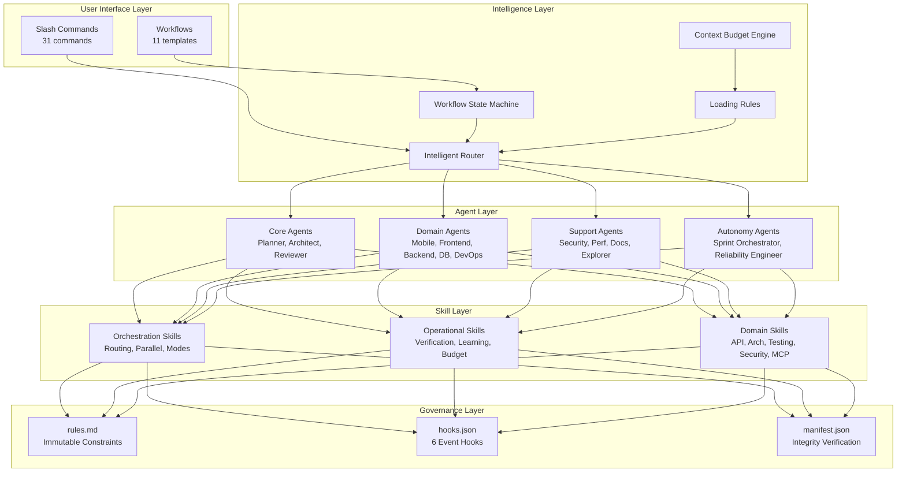

# 🚀 Antigravity AI Kit


<p align="center">
  <b>🎯 Transform Your IDE into an AI Engineering Team</b>
</p>

<p align="center">
  Antigravity AI Kit is a <b>Trust-Grade AI development framework</b> that brings <b>19 specialized agents</b>, <b>31 commands</b>, <b>28 skills</b>, and <b>11 workflows</b> to help you code 10x faster with governance-first principles.
</p>

<p align="center">
  🚀 <a href="#-quick-start">Quick Start</a> •
  🤖 <a href="#-agents-19">Agents</a> •
  🛠️ <a href="#%EF%B8%8F-skills-28">Skills</a> •
  ⌨️ <a href="#%EF%B8%8F-commands-31">Commands</a> •
  🔄 <a href="#-session-management">Sessions</a> •
  ⚖️ <a href="#%EF%B8%8F-operating-constraints">Governance</a>
</p>

---

## 📚 Table of Contents

- [What is Antigravity AI Kit?](#-what-is-antigravity-ai-kit)
- [Key Features](#-key-features)
- [Quick Start](#-quick-start)
- [Architecture](#%EF%B8%8F-architecture-overview)
- [Agents](#-agents-19)
- [Commands](#%EF%B8%8F-commands-31)
- [Skills](#%EF%B8%8F-skills-28)
- [Workflows](#-workflows-11)
- [Operating Constraints](#%EF%B8%8F-operating-constraints)
- [Session Management](#-session-management)
- [How to Extend](#-how-to-extend)
- [Contributing](#-contributing)

---

## 🤔 What is Antigravity AI Kit?

**Antigravity AI Kit** transforms your IDE into a **virtual engineering team** with:

| Feature           | Count | Description                                                            |
| :---------------- | :---- | :--------------------------------------------------------------------- |
| 🤖 **AI Agents**  | 19    | Specialized roles (Mobile, DevOps, Database, Security, Performance...) |
| 🛠️ **Skills**     | 28    | Domain knowledge modules (API, Testing, MCP, Architecture, Docker...) |
| ⌨️ **Commands**   | 31    | Slash commands for every development workflow                          |
| 🔄 **Workflows**  | 11    | Process templates (/create, /debug, /deploy, /test...)                 |
| ✅ **Checklists** | 3     | Quality gates (session-start, session-end, pre-commit)                 |
| ⚖️ **Rules**      | 5     | Immutable governance constraints                                       |
| 🔗 **Hooks**      | 6     | Event-driven automation (runtime + git-hook enforcement)               |

---

## ✨ Key Features

- **🔒 Trust-Grade Governance**: `/explore → /plan → /work → /review` — Each iteration builds context
- **🤖 Multi-Agent System**: 19 specialized agents that collaborate (Mobile Developer, DevOps, Database Architect, Sprint Orchestrator...)
- **📦 Context as Artifact**: Persistent markdown files for plans, specs, and decisions
- **🔄 Continuous Learning**: PAAL cycle extracts patterns from every session
- **🛡️ Security First**: Built-in secret detection, vulnerability scanning, and compliance checks

### Core Philosophy

> **"Trust > Optimization. Safety > Growth. Explainability > Performance."**

---

## ⚡ Quick Start

### Option 1: Create New Project (Recommended)

```bash
npx create-antigravity-app my-project
npx create-antigravity-app my-api --template node-api
npx create-antigravity-app my-app --template nextjs
```

Creates a new project with `.agent/` pre-configured. Templates: `minimal`, `node-api`, `nextjs`.

### Option 2: Add to Existing Project

```bash
npx antigravity-ai-kit init
```

This automatically copies the `.agent/` folder to your project.

### Option 3: Manual Installation

```bash
# 1. Clone the repository
git clone https://github.com/besync-labs/antigravity-ai-kit.git

# 2. Copy .agent/ to your project
cp -r antigravity-ai-kit/.agent/ your-project/.agent/

# 3. Start your session
/status
```

That's it! The kit is now active and ready to accelerate your development.

---

## 🏗️ Architecture Overview



### How It Works: The Autonomy Engine

Antigravity AI Kit uses a **6-phase workflow state machine** that guides development:

```
EXPLORE → PLAN → IMPLEMENT → VERIFY → REVIEW → DEPLOY
```

| Phase | What Happens | Transition Guard |
|:------|:-------------|:-----------------|
| **EXPLORE** | Codebase discovery, research | Exploration artifact exists |
| **PLAN** | Implementation plan with user approval | Plan approved by user |
| **IMPLEMENT** | Code generation with agent routing | Auto on commit |
| **VERIFY** | Quality gates, tests, lint | All gates pass |
| **REVIEW** | Code review (human or Copilot) | Review approved |
| **DEPLOY** | Production deployment | Deployment checklist complete |

**Intelligent Routing**: The kit analyzes your request keywords and automatically loads the right agents and skills (max 4 agents + 6 skills per session to stay within context budgets).

---

## 🤖 Agents (19)

### Core Development

| Agent              | Role                    | Triggers                          |
| :----------------- | :---------------------- | :-------------------------------- |
| **Architect**      | System design, patterns | architecture, design, scalability |
| **Code Reviewer**  | Quality assurance       | review, quality, best practices   |
| **TDD Specialist** | Test-driven development | test, tdd, coverage               |

### Domain Specialists

| Agent                    | Role                          | Triggers                     |
| :----------------------- | :---------------------------- | :--------------------------- |
| **Mobile Developer**     | iOS/Android patterns          | mobile, react-native, expo   |
| **Frontend Specialist**  | React, Vue, UI/UX             | frontend, component, styling |
| **Backend Specialist**   | Node.js, NestJS, APIs         | backend, api, server         |
| **Database Architect**   | Schema, queries, optimization | database, prisma, sql        |
| **DevOps Engineer**      | CI/CD, Docker, deployment     | devops, docker, deploy       |
| **Security Auditor**     | Vulnerabilities, compliance   | security, auth, audit        |
| **Performance Engineer** | Optimization, profiling       | performance, speed, metrics  |

### Support & Intelligence

| Agent                    | Role                       | Triggers              |
| :----------------------- | :------------------------- | :-------------------- |
| **Documentation Writer** | Docs, READMEs, guides      | documentation, readme |
| **Build Error Resolver** | Rapid build fixes          | build, error, compile |
| **Refactorer**           | Code cleanup, optimization | refactor, cleanup     |
| **Explorer Agent**       | Codebase discovery         | explore, scout, discover |
| **Knowledge Agent**      | RAG retrieval              | knowledge, search, context |

### Autonomy Agents

| Agent                    | Role                              | Triggers                      |
| :----------------------- | :-------------------------------- | :---------------------------- |
| **Planner**              | Task breakdown, Socratic analysis | plan, breakdown, requirements |
| **Sprint Orchestrator**  | Sprint planning, velocity         | sprint, roadmap, velocity     |
| **Reliability Engineer** | SRE, production readiness         | reliability, SLA, monitoring  |

---

## ⌨️ Commands (31)

### Core Workflow

| Command      | Description                |
| :----------- | :------------------------- |
| `/plan`      | Create implementation plan |
| `/implement` | Execute the plan           |
| `/verify`    | Run all quality gates      |
| `/status`    | Check project status       |

### Development

| Command     | Description                   |
| :---------- | :---------------------------- |
| `/build`    | Build a new feature           |
| `/fix`      | Fix linting/type errors       |
| `/debug`    | Systematic debugging          |
| `/refactor` | Improve code quality          |
| `/cook`     | Full scratch-to-done workflow |

### Documentation & Git

| Command      | Description                  |
| :----------- | :--------------------------- |
| `/doc`       | Generate documentation       |
| `/adr`       | Create architecture decision |
| `/changelog` | Generate changelog           |
| `/git`       | Git operations               |
| `/pr`        | Create/manage pull requests  |

### Exploration & Research

| Command     | Description              |
| :---------- | :----------------------- |
| `/scout`    | Explore codebase         |
| `/research` | Research technologies    |
| `/ask`      | Ask questions about code |

### Quality & Security

| Command          | Description             |
| :--------------- | :---------------------- |
| `/code-review`   | Run code review         |
| `/tdd`           | Test-driven development |
| `/security-scan` | Security audit          |
| `/perf`          | Performance analysis    |

### Integration & Deployment

| Command      | Description              |
| :----------- | :----------------------- |
| `/integrate` | Third-party integrations |
| `/db`        | Database operations      |
| `/deploy`    | Deploy to environment    |
| `/design`    | UI/UX design             |

### Context Management

| Command       | Description       |
| :------------ | :---------------- |
| `/learn`      | Extract patterns  |
| `/checkpoint` | Save progress     |
| `/compact`    | Compress context  |
| `/eval`       | Evaluate metrics  |
| `/setup`      | Configure project |
| `/help`       | Show help         |

---

## 🛠️ Skills (28)

### Operational Skills (5)

| Skill                 | Purpose                   |
| :-------------------- | :------------------------ |
| `verification-loop`   | Continuous quality gates  |
| `continuous-learning` | Pattern extraction (PAAL) |
| `strategic-compact`   | Context window management |
| `eval-harness`        | Performance evaluation    |
| `context-budget`      | Active token budget management |

### Orchestration Skills (4)

| Skill                 | Purpose                   |
| :-------------------- | :------------------------ |
| `intelligent-routing` | Auto agent selection      |
| `parallel-agents`     | Multi-agent orchestration |
| `behavioral-modes`    | Adaptive AI operation     |
| `mcp-integration`     | MCP server integration    |

### Domain Skills (12)

| Skill                  | Purpose                         |
| :--------------------- | :------------------------------ |
| `api-patterns`         | RESTful API design              |
| `architecture`         | System design patterns          |
| `clean-code`           | Code quality principles         |
| `database-design`      | Schema optimization             |
| `testing-patterns`     | TDD, unit, integration          |
| `typescript-expert`    | Advanced TypeScript             |
| `frontend-patterns`    | React, component design         |
| `nodejs-patterns`      | Backend patterns                |
| `debugging-strategies` | Systematic debugging            |
| `security-practices`   | OWASP, vulnerability prevention |
| `docker-patterns`      | Containerization                |
| `git-workflow`         | Branching, commits              |

### Development Skills (7)

| Skill                   | Purpose                 |
| :---------------------- | :---------------------- |
| `app-builder`           | Full-stack scaffolding  |
| `mobile-design`         | Mobile UI/UX patterns   |
| `webapp-testing`        | E2E, Playwright testing |
| `deployment-procedures` | CI/CD, rollback         |
| `performance-profiling` | Core Web Vitals         |
| `brainstorming`         | Socratic discovery      |
| `plan-writing`          | Structured planning     |

---

## 🔄 Workflows (11)

| Workflow          | Description              | Command          |
| :---------------- | :----------------------- | :--------------- |
| **brainstorm**    | Creative ideation        | `/brainstorm`    |
| **create**        | Scaffold new features    | `/create`        |
| **debug**         | Systematic debugging     | `/debug`         |
| **deploy**        | Deployment process       | `/deploy`        |
| **enhance**       | Improve existing code    | `/enhance`       |
| **orchestrate**   | Multi-agent coordination | `/orchestrate`   |
| **plan**          | Implementation planning  | `/plan`          |
| **preview**       | Preview changes          | `/preview`       |
| **status**        | Project status check     | `/status`        |
| **test**          | Test writing workflow    | `/test`          |
| **ui-ux-pro-max** | Premium UI design        | `/ui-ux-pro-max` |

---

## ⚖️ Operating Constraints

### Immutable Rules

1. **Trust > Optimization** — Never compromise trust for speed
2. **Safety > Growth** — Prevent harm before enabling capability
3. **No Memory of Previous Sessions** — Treat each session as fresh
4. **Explainability > Performance** — Be transparent about decisions
5. **Human Override Always Available** — User can always interrupt

### Governance Protocol

```
/explore → /plan → /work → /review → /deploy
```

Each phase requires explicit approval before proceeding.

---

## 🔄 Session Management

> **The secret to 10x productivity**: Never lose context between sessions.

Antigravity AI Kit includes a robust **Session Management Architecture** that ensures continuity across work sessions. This is what separates casual AI usage from Trust-Grade AI development.

### How It Works

```
┌─────────────────────────────────────────────────────────────────────┐
│                     SESSION LIFECYCLE                                │
├─────────────────────────────────────────────────────────────────────┤
│                                                                      │
│  ┌──────────────┐       ┌──────────────┐       ┌──────────────┐     │
│  │ Session      │  ───► │   WORK       │  ───► │ Session      │     │
│  │ Start Hook   │       │   SESSION    │       │ End Hook     │     │
│  └──────────────┘       └──────────────┘       └──────────────┘     │
│         │                      │                      │              │
│         ▼                      ▼                      ▼              │
│  ┌──────────────┐       ┌──────────────┐       ┌──────────────┐     │
│  │ Load Context │       │ Pre-Commit   │       │ Save State   │     │
│  │ Verify Env   │       │ Quality Gate │       │ Handoff Docs │     │
│  └──────────────┘       └──────────────┘       └──────────────┘     │
│                                                                      │
└─────────────────────────────────────────────────────────────────────┘
```

### Key Components

| Component                   | Purpose                       | Location                             |
| :-------------------------- | :---------------------------- | :----------------------------------- |
| **Session Context**         | Live session state, resumable | `.agent/session-context.md`          |
| **Session Start Checklist** | Pre-flight verification       | `.agent/checklists/session-start.md` |
| **Session End Checklist**   | Wrap-up and handoff           | `.agent/checklists/session-end.md`   |
| **Pre-Commit Checklist**    | Quality gate before commits   | `.agent/checklists/pre-commit.md`    |

### Usage

**Starting a Session:**

```
Follow the session-start checklist
```

The AI will:

1. ✅ Load previous session context
2. ✅ Verify git status and branch
3. ✅ Check dependencies and build
4. ✅ Resume from last open task

**During Work:**

```
/verify  # Run quality checks before commits
```

**Ending a Session:**

```
Follow the session-end checklist
```

The AI will:

1. ✅ Update session-context.md with progress
2. ✅ Document open items and next steps
3. ✅ Commit all changes
4. ✅ Create handoff notes

### Productivity Benefits

| Benefit                | Description                                   |
| :--------------------- | :-------------------------------------------- |
| **Zero Ramp-Up Time**  | Context loads automatically, resume instantly |
| **No Lost Work**       | State persisted across sessions               |
| **Consistent Quality** | Same quality gates every time                 |
| **Clean Handoffs**     | Anyone can continue your work                 |
| **Audit Trail**        | Every session documented                      |

### Example Session Context

```markdown
# AI Session Context

## Last Session Summary

**Date**: February 5, 2026
**Focus**: User authentication feature

### What Was Done

- ✅ Implemented JWT refresh tokens
- ✅ Added login/logout endpoints
- [ ] Email verification (in progress)

### Open Items

1. [ ] Complete email verification
2. [ ] Add password reset flow

## Quick Resume

cd my-project && npm run dev
```

---

## 🔧 How to Extend

### Adding Custom Agents

```markdown
## <!-- .agent/agents/my-agent.md -->

name: my-agent
description: Custom agent description
triggers: [keyword1, keyword2]

---

# My Agent

Instructions for the agent...
```

### Adding Custom Skills

```markdown
## <!-- .agent/skills/my-skill/SKILL.md -->

name: my-skill
description: What this skill does
triggers: [context, keywords]

---

# My Skill

## Overview

...

## Workflow

...
```

### Adding Custom Commands

```markdown
## <!-- .agent/commands/my-command.md -->

## description: What this command does

# /my-command

Usage and instructions...
```

---

## 📁 Repository Structure

```
antigravity-ai-kit/
├── .agent/                    # Core AI Kit
│   ├── agents/               # 19 specialized agents
│   ├── commands/             # 31 slash commands
│   ├── skills/               # 28 capability modules
│   ├── workflows/            # 11 process templates
│   ├── engine/               # Autonomy Engine (state machine, loading rules)
│   ├── hooks/                # 6 event hooks (runtime + git-hook)
│   ├── rules.md              # Governance rules
│   ├── checklists/           # Verification checklists (3)
│   ├── templates/            # ADR, feature-request, bug-report templates
│   ├── decisions/            # Architecture Decision Records
│   └── manifest.json         # Machine-readable capability registry
├── bin/                       # CLI (ag-kit)
├── create-antigravity-app/    # Project scaffolder (separate npm package)
├── tests/                     # Test suites (43 tests)
│   ├── unit/                 # CLI tests
│   ├── structural/           # Inventory + schema validation
│   └── security/             # Injection scan + leakage detection
├── examples/                  # Usage examples (minimal, full-stack)
├── .github/workflows/         # CI pipeline
├── .githooks/                 # Secret detection pre-commit hook
├── README.md                  # This file
├── LICENSE                    # MIT License
└── CHANGELOG.md               # Version history
```

---

## 🤝 Contributing

We welcome contributions! See [CONTRIBUTING.md](CONTRIBUTING.md) for guidelines.

### Development Workflow

1. Fork the repository
2. Create a feature branch
3. Make your changes
4. Run verification: `/verify`
5. Submit a pull request

---

## 📄 License

MIT License — See [LICENSE](LICENSE) for details.

---

## 👤 Author

**Emre Dursun** — Full-Stack Automation Engineer | AI Development Specialist

[](https://www.linkedin.com/in/emre-dursun-nl/)
[](https://emredursun.nl/)

> _Creator of BeSync and the Trust-Grade AI Governance framework_

---

## 🔗 Links

- **Repository**: [github.com/besync-labs/antigravity-ai-kit](https://github.com/besync-labs/antigravity-ai-kit)
- **Documentation**: [besync-labs.github.io/antigravity-ai-kit](https://besync-labs.github.io/antigravity-ai-kit)
- **Origin**: Derived from BeSync Trust-Grade AI Governance

---

## 🙏 Acknowledgments

- Initial patterns from [vudovn/antigravity-kit](https://github.com/vudovn/antigravity-kit)
- Command structure inspired by [nth5693/gemini-kit](https://github.com/nth5693/gemini-kit)
- Context-driven development from [Google Conductor](https://developers.googleblog.com/en/conductor-introducing-context-driven-development-for-gemini-cli/)
- Hook concepts from [everything-claude-code](https://github.com/affaan-m/everything-claude-code)

_Antigravity AI Kit v2.1.0 extends these foundations with Trust-Grade governance, session management, and 90+ capabilities._

---

<p align="center">
  <b>Built with 💜 for developers who demand excellence</b>
</p>

<p align="center">
  <a href="https://github.com/besync-labs/antigravity-ai-kit">⭐ Star me on GitHub</a>
</p>
