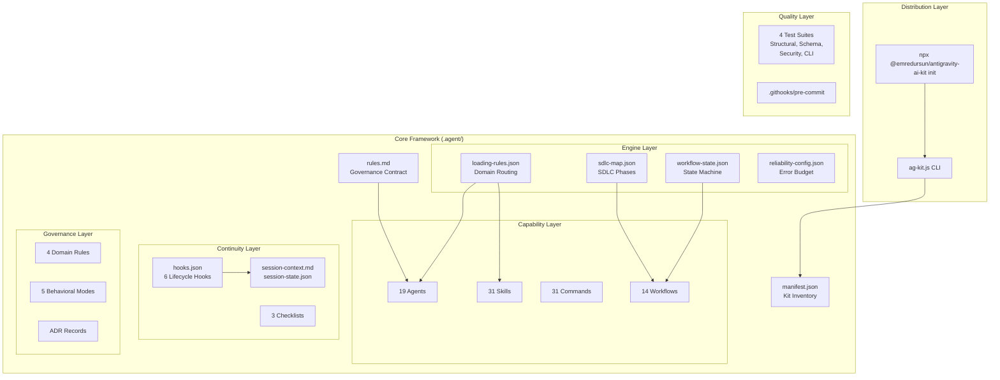
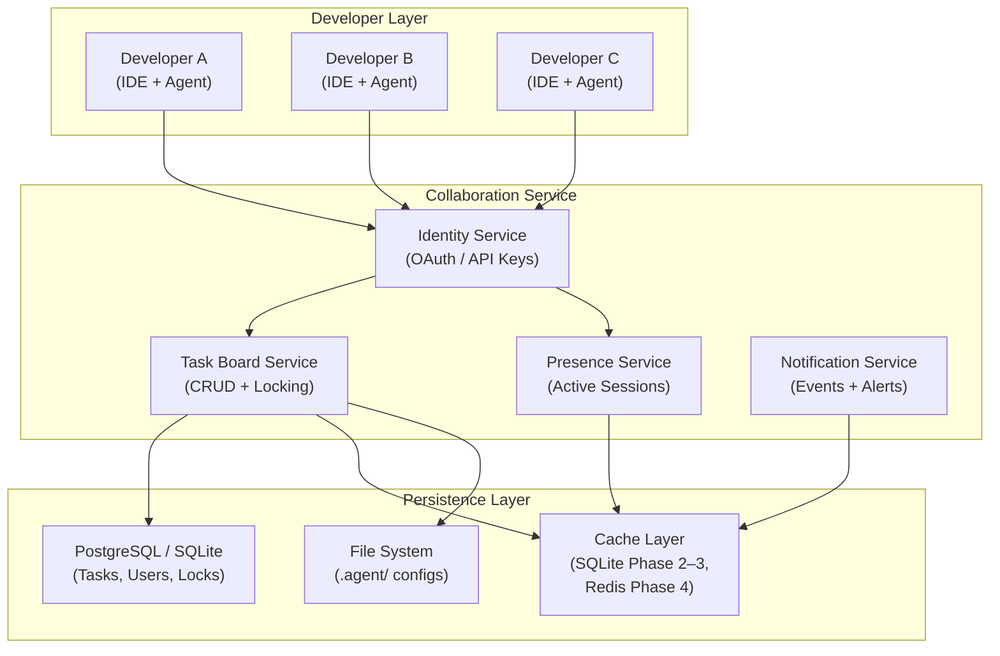
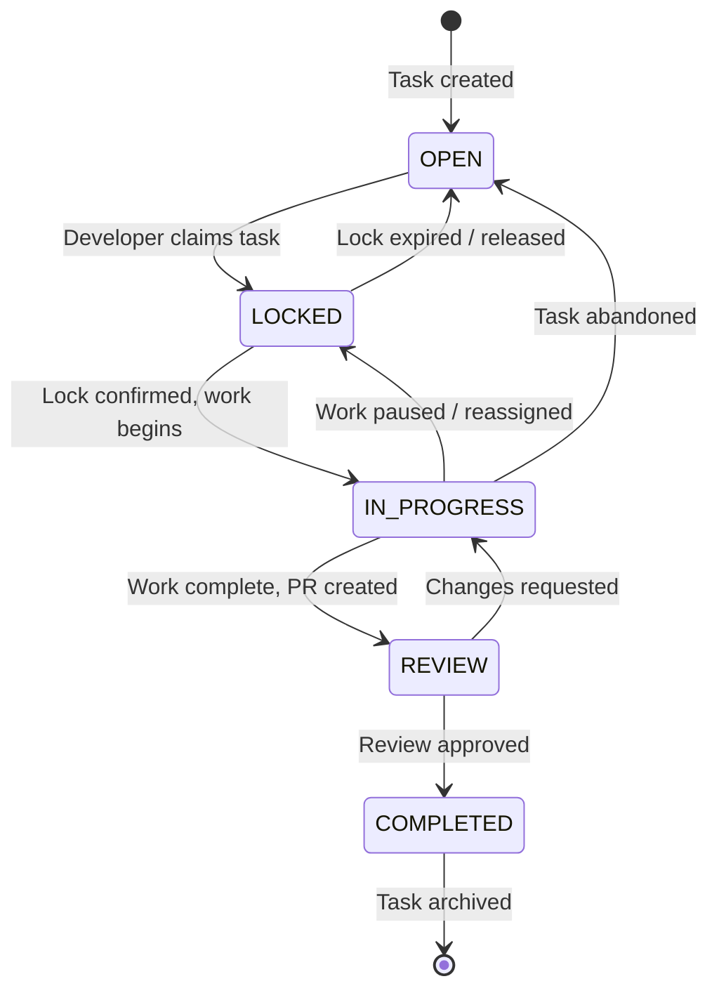
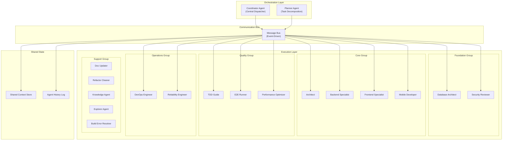
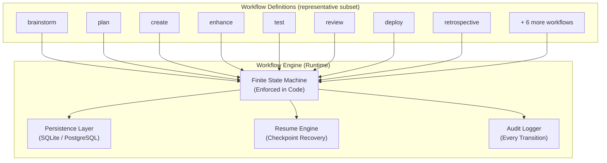
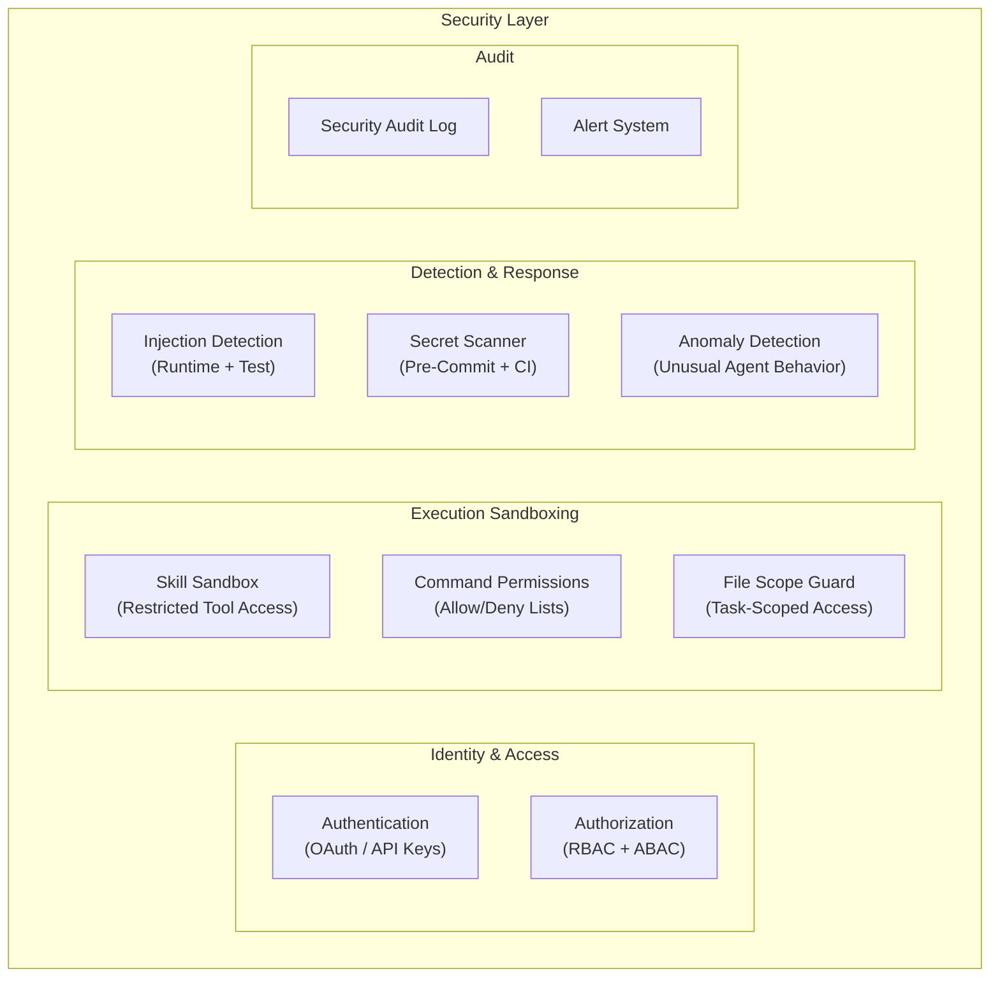
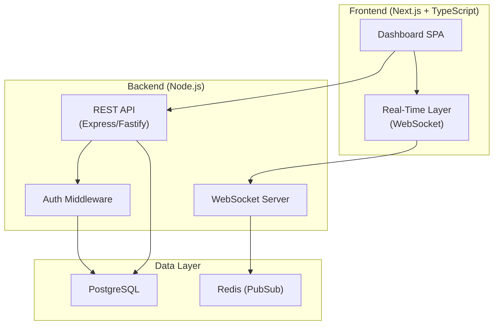
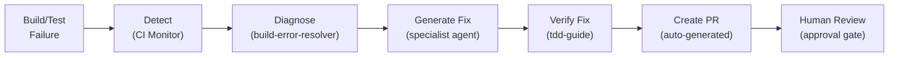

# 🚀 ANTIGRAVITY AI KIT — 10,000× EVOLUTION REPORT

> **Classification**: Principal Architecture Review  
> **Author**: 10,000× Engineering Brain  
> **Date**: March 13, 2026  
> **Subject**: Antigravity AI Kit v2.1.0 → Enterprise-Grade AI Engineering Operating System  
> **Scope**: Complete Architectural Analysis, Redesign Proposals, and 12-Month Roadmap

---

## Table of Contents

1. [Executive Summary](#1-executive-summary)
2. [Current Architecture Map](#2-current-architecture-map)
3. [Structural Analysis & Gap Identification](#3-structural-analysis--gap-identification)
4. [Multi-Developer Collaboration System](#4-multi-developer-collaboration-system)
5. [Task Governance Engine](#5-task-governance-engine)
6. [Agent Orchestration Architecture](#6-agent-orchestration-architecture)
7. [Workflow Engine Redesign](#7-workflow-engine-redesign)
8. [Security Architecture](#8-security-architecture)
9. [Reliability Engineering](#9-reliability-engineering)
10. [Developer Experience Architecture](#10-developer-experience-architecture)
11. [Team Collaboration Dashboard](#11-team-collaboration-dashboard)
12. [Competitor Benchmarking](#12-competitor-benchmarking)
13. [Revolutionary Feature Proposals](#13-revolutionary-feature-proposals)
14. [Implementation Roadmap](#14-implementation-roadmap)
15. [Appendices](#15-appendices)

---

## 1. Executive Summary

Antigravity AI Kit v2.1.0 is a **remarkably well-structured prompt-engineering framework** with 19 agents, 31 skills, 31 commands, and 14 workflows organized under a Trust-Grade governance philosophy. It is currently the **most thoughtfully designed open-source AI development agent kit available**, with production-grade structural integrity testing, injection scanning, and an NPX-based distribution model.

However, there is a **fundamental architectural ceiling**: the system operates as a **single-developer, stateless, prompt-only framework** with no runtime engine, no persistent state management, no distributed task coordination, and no multi-developer awareness. This limits it to being a sophisticated set of LLM prompt templates rather than a true autonomous engineering platform.

**This report proposes evolving Antigravity AI Kit from a v2.x prompt-engineering framework into a v3.x — v5.x enterprise-grade AI Engineering Operating System**, capable of:

- Multi-developer agent coordination with task ownership
- Persistent, resumable workflow execution
- Enterprise-grade task governance with locking
- Agent orchestration with message-driven communication
- Security sandboxing for untrusted skill execution
- Real-time team collaboration dashboards
- Revolutionary features that set global competitive differentiation

### Current State Summary

| Dimension | v2.1.0 State | Target State |
|:---|:---|:---|
| **Architecture** | Prompt templates (markdown) | Runtime engine + prompt templates |
| **Collaboration** | Single developer | Multi-developer with task ownership |
| **Task Management** | JSON template (no persistence) | Distributed governance engine |
| **Agent Execution** | LLM-interpreted prompts | Orchestrated agent runtime |
| **Workflow Engine** | Declarative state machine (JSON) | Persistent, resumable state machine |
| **Security** | Static injection scanning | Sandboxed execution + permission model |
| **Reliability** | Error budget config (disabled) | Active retry/recovery with circuit breakers |
| **Distribution** | NPX CLI (file copy) | NPX CLI + plugin system + marketplace |
| **Dashboard** | None | Real-time web dashboard |

### 1.1 Backward Compatibility Guarantee

> [!IMPORTANT]
> **Opt-In Architecture Principle**: All new capabilities introduced in v3.x+ are **additive and opt-in**. The existing single-developer, prompt-only workflow remains fully functional without any new dependencies. Specifically:
> - The `.agent/` folder structure, [manifest.json](file:///d:/ProfesionalDevelopment/AntigravityProjects/antigravity-ai-kit/.agent/manifest.json) schema, and all markdown-based agents/skills/workflows remain unchanged.
> - No runtime engine, database, or external service is required for existing functionality.
> - New features (task governance, collaboration, dashboard) are activated only via explicit CLI commands (e.g., `ag-kit init --team`).
> - `ag-kit init` continues to work exactly as it does today for single-developer setups.

---

## 2. Current Architecture Map

### 2.1 Repository Structure

```
antigravity-ai-kit/
├── .agent/                           # Core AI Framework (prompt-driven)
│   ├── agents/                       # 19 specialized agent prompts (.md)
│   ├── skills/                       # 31 modular knowledge domains (SKILL.md each)
│   ├── commands/                     # 31 slash command definitions (.md)
│   ├── workflows/                    # 14 SDLC workflow definitions (.md)
│   ├── engine/                       # Configuration-driven engine layer
│   │   ├── loading-rules.json        # Domain-based agent/skill routing
│   │   ├── workflow-state.json       # Deterministic state machine
│   │   ├── sdlc-map.json            # 6-phase SDLC lifecycle mapping
│   │   └── reliability-config.json   # SRE error budget (disabled)
│   ├── hooks/                        # Lifecycle hook definitions
│   │   ├── hooks.json               # 6 hooks: session-start/end, pre-commit, etc.
│   │   └── templates/               # Hook output templates
│   ├── checklists/                   # Session checklists (start, end, pre-commit)
│   ├── contexts/                     # Behavioral mode contexts (5 modes)
│   ├── decisions/                    # Architecture Decision Records
│   ├── rules/                        # Governance rules (4 domains)
│   ├── templates/                    # Document templates (ADR, bug, feature)
│   ├── rules.md                      # Master governance contract (274 lines)
│   ├── manifest.json                 # Kit inventory (schema v1.0.0)
│   ├── session-context.md            # Handoff notes (manual)
│   └── session-state.json            # Session state template (manual)
├── bin/
│   └── ag-kit.js                     # NPX CLI tool (250 lines)
├── create-antigravity-app/           # Project scaffolder
├── tests/                            # Vitest test suites
│   ├── structural/                   # Inventory + schema validation
│   ├── security/                     # Injection + secret scanning
│   └── unit/                         # CLI tests
├── docs/                             # MkDocs documentation site
├── .githooks/                        # Git hook scripts
├── .github/                          # CI workflows + issue templates
├── package.json                      # NPM package (v2.1.0)
└── vitest.config.js                  # Test configuration
```

### 2.2 System Architecture Diagram



### 2.3 Data Flow: User Request → Agent Execution

```
┌──────────────┐     ┌──────────────┐     ┌──────────────┐     ┌──────────────┐
│  User types  │ ──▸ │ LLM reads    │ ──▸ │ LLM matches  │ ──▸ │ LLM behaves  │
│  /command    │     │ rules.md +   │     │ loading-rules │     │ as selected  │
│  or request  │     │ manifest     │     │ keywords to   │     │ agent with   │
│              │     │              │     │ select agent  │     │ skill context│
└──────────────┘     └──────────────┘     └──────────────┘     └──────────────┘

CRITICAL INSIGHT: The entire system relies on LLM prompt interpretation.
There is NO runtime engine — all "execution" is prompt-driven.
```

---

## 3. Structural Analysis & Gap Identification

### 3.1 Architectural Strengths (What's Excellent)

| # | Strength | Evidence |
|:--|:---|:---|
| S1 | **Trust-Grade Governance** | Immutable operating constraints, 3-Role Architecture, 8 Meta-Directives, constructive insubordination principle |
| S2 | **Deterministic State Machine** | [workflow-state.json](file:///d:/ProfesionalDevelopment/AntigravityProjects/antigravity-ai-kit/.agent/engine/workflow-state.json) defines 7 phases with 12 transitions, guards, and bidirectional movement |
| S3 | **Domain-Aware Loading** | [loading-rules.json](file:///d:/ProfesionalDevelopment/AntigravityProjects/antigravity-ai-kit/.agent/engine/loading-rules.json) maps 13 domains to agents/skills via keyword matching with context budget limits |
| S4 | **Structural Integrity Testing** | Inventory tests verify manifest ↔ filesystem consistency; schema tests validate all JSON configs |
| S5 | **Security Scanning** | Injection detection (5 patterns), secret detection (4 patterns), BeSync leakage detection, aspirational reference detection |
| S6 | **SDLC Lifecycle Mapping** | [sdlc-map.json](file:///d:/ProfesionalDevelopment/AntigravityProjects/antigravity-ai-kit/.agent/engine/sdlc-map.json) maps 6 phases (discover → plan → build → verify → ship → evaluate) with reactive/cross-cutting categories |
| S7 | **Professional Session Management** | Hooks + checklists provide structured session start/end protocols |
| S8 | **NPX Distribution** | `ag-kit init` copies `.agent/` folder with verification — clean onboarding |

### 3.2 Critical Architectural Gaps

> [!CAUTION]
> The following gaps represent **fundamental architectural limitations** that prevent the platform from reaching enterprise-grade status.

#### GAP-1: No Runtime Engine

**Severity**: 🔴 Critical  
**Impact**: The entire system is prompt-interpreted, not machine-executed

The `engine/` directory contains JSON configuration files that are **read by LLMs**, not executed by a runtime. The [workflow-state.json](file:///d:/ProfesionalDevelopment/AntigravityProjects/antigravity-ai-kit/.agent/engine/workflow-state.json) state machine has no code that enforces transitions. The [loading-rules.json](file:///d:/ProfesionalDevelopment/AntigravityProjects/antigravity-ai-kit/.agent/engine/loading-rules.json) routing has no code that performs keyword matching. The hooks in [hooks.json](file:///d:/ProfesionalDevelopment/AntigravityProjects/antigravity-ai-kit/.agent/hooks/hooks.json) have no code that triggers them.

**Current Reality**: Everything depends on the LLM being "well-behaved" and following the JSON specs. There is zero enforcement of:
- State machine transitions (no guard validation code)
- Context budget limits (no token counting)
- Hook execution (no trigger mechanism)
- Loading rule enforcement (no keyword matching engine)

#### GAP-2: No Multi-Developer Support

**Severity**: 🔴 Critical  
**Impact**: Cannot scale beyond single-developer usage

There is **zero infrastructure** for:
- Developer identity (no `developer_id` concept)
- Task ownership (no `assigned_to` field with enforcement)
- Concurrent access control (no locking)
- Cross-developer awareness (no shared state)

The [session-context.md](file:///d:/ProfesionalDevelopment/AntigravityProjects/antigravity-ai-kit/.agent/session-context.md) and [session-state.json](file:///d:/ProfesionalDevelopment/AntigravityProjects/antigravity-ai-kit/.agent/session-state.json) are **single-instance files** with no multi-tenant design.

#### GAP-3: No Persistent Task Management

**Severity**: 🔴 Critical  
**Impact**: Task state is lost between sessions; no audit trail

[session-state.json](file:///d:/ProfesionalDevelopment/AntigravityProjects/antigravity-ai-kit/.agent/session-state.json) is a **template** (all fields null). There is no:
- Task database or persistent store
- Task lifecycle tracking
- Historical audit log
- Sprint velocity metrics (promised in agent specs but unimplemented)

#### GAP-4: No Agent Communication Protocol

**Severity**: 🟡 High  
**Impact**: Agents cannot share context or coordinate work

The `parallel-agents` skill describes orchestration patterns but relies entirely on **LLM session memory**. There is no:
- Message bus or event system
- Shared context store
- Agent-to-agent communication protocol
- Conflict detection mechanism

#### GAP-5: No Skill Sandboxing

**Severity**: 🟡 High  
**Impact**: Skills can execute arbitrary code without permission boundaries

Skills are markdown prompts that can instruct LLMs to perform any operation. The `allowed-tools` frontmatter field (e.g., `allowed-tools: Read, Glob, Grep`) is **advisory only** — no code enforces it.

#### GAP-6: Stale Session Context

**Severity**: 🟡 High  
**Impact**: Session context is outdated (last updated Feb 6, 2026) and manually maintained

The [session-context.md](file:///d:/ProfesionalDevelopment/AntigravityProjects/antigravity-ai-kit/.agent/session-context.md) references v2.0.0 while the system is at v2.1.0. The [session-state.json](file:///d:/ProfesionalDevelopment/AntigravityProjects/antigravity-ai-kit/.agent/session-state.json) is a blank template. This undermines the session management architecture.

#### GAP-7: No Plugin or Extension System

**Severity**: 🟡 Medium  
**Impact**: Users must manually copy markdown files to add agents, skills, or workflows. There is no standardized plugin interface, no `ag-kit install <plugin>` command, and no discovery mechanism for community-contributed capabilities.

#### GAP-8: CLI Feature Stubs

**Severity**: 🟢 Low  
**Impact**: `update` command says "not yet implemented"; `verify` command says "coming in v2.2.0"

### 3.3 Structural Issues Summary

| Category | Issue | Severity |
|:---|:---|:---|
| **Tight Coupling** | Workflows reference agents by name in markdown with no indirection layer | Medium |
| **Missing Abstraction** | No Agent Interface contract; agents are free-form markdown | High |
| **Dead Functionality** | [reliability-config.json](file:///d:/ProfesionalDevelopment/AntigravityProjects/antigravity-ai-kit/.agent/engine/reliability-config.json) has `errorBudget.enabled: false`; zero implementation | Medium |
| **Unscalable Patterns** | File-based session state (no database); single-instance config files | Critical |
| **Missing Extensibility** | No plugin system; no skill marketplace; no custom agent registration | High |
| **Inconsistent Naming** | Mixed `camelCase` and `kebab-case` in JSON keys across engine files | Low |

---

## 4. Multi-Developer Collaboration System

### 4.1 Current State Assessment

**Verdict**: ❌ **Not supported.** Zero multi-developer infrastructure exists.

The platform is designed for a single developer operating a single AI agent session. There is no concept of:
- Developer registration or identity
- Team membership
- Shared task boards
- Conflict prevention between simultaneous users

### 4.2 Proposed Architecture: Team Collaboration Layer



### 4.3 Developer Identity Model

```typescript
interface Developer {
  developerId: string;        // UUID v4
  displayName: string;        // "Emre Dursun"
  email: string;              // "info@emredursun.nl"
  role: DeveloperRole;        // OWNER | ADMIN | DEVELOPER | VIEWER
  activeSessionId: string | null;
  lastActiveAt: Date;
  preferences: DeveloperPreferences;
}

interface DeveloperPreferences {
  defaultBranch: string;
  preferredAgents: string[];
  notificationLevel: 'all' | 'mentions' | 'critical';
}

type DeveloperRole = 'OWNER' | 'ADMIN' | 'DEVELOPER' | 'VIEWER';
```

### 4.4 Conflict Prevention Strategy

| Strategy | Description | Implementation |
|:---|:---|:---|
| **File Locking** | Prevent two agents from editing the same file | Advisory lockfile with developer ID |
| **Task Ownership** | Only the assigned developer's agent can work on a task | Database-enforced constraint |
| **Branch Isolation** | Each developer works on their own feature branch | Git branching strategy enforcement |
| **Presence Awareness** | Agents know which files other developers are editing | Redis-based presence broadcasting |
| **Merge Coordinator** | Automated merge conflict detection before push | Pre-push hook with conflict scanning |

---

## 5. Task Governance Engine

### 5.1 Task Lifecycle State Machine



### 5.2 Task Data Model

```typescript
interface Task {
  taskId: string;              // "TASK-001" or UUID
  title: string;               // "Implement OAuth login"
  description: string;         // Detailed requirements
  status: TaskStatus;          // OPEN | LOCKED | IN_PROGRESS | REVIEW | COMPLETED
  priority: TaskPriority;      // P0 | P1 | P2 | P3
  assignedTo: string | null;   // Developer ID
  lockedBy: string | null;     // Developer ID + session
  lockExpiresAt: Date | null;  // Auto-release time
  milestoneId: string | null;  // Milestone or release association
  labels: string[];            // ["security", "backend"]
  estimatedEffort: string;     // "S" | "M" | "L" | "XL"
  actualEffort: string | null; // Tracked after completion
  branchName: string | null;   // Feature branch for this task
  pullRequestId: number | null;
  agentHistory: AgentExecution[];  // Full agent execution audit trail
  createdAt: Date;
  updatedAt: Date;
  completedAt: Date | null;
}

type TaskStatus = 'OPEN' | 'LOCKED' | 'IN_PROGRESS' | 'REVIEW' | 'COMPLETED';
type TaskPriority = 'P0' | 'P1' | 'P2' | 'P3';

interface AgentExecution {
  agentName: string;           // "security-reviewer"
  action: string;              // "Reviewed auth module"
  timestamp: Date;
  filesModified: string[];
  duration: number;            // Seconds
}
```

#### 5.2.1 Data Governance

- **Retention**: Audit trail logs retained for 12 months by default; configurable per team.
- **Classification**: Developer identity (PII) stored separately from operational task data; PII fields encrypted at rest.
- **Right-to-Erasure**: `ag-kit team remove <id> --purge-data` anonymizes developer records while preserving task history.
- **Access Control**: Task history queries scoped to team membership; no cross-team data leakage.

### 5.3 Task Locking System

```typescript
interface TaskLock {
  taskId: string;
  lockedBy: string;            // Developer ID
  sessionId: string;           // Session that acquired the lock
  acquiredAt: Date;
  expiresAt: Date;             // Default: 4 hours
  heartbeatAt: Date;           // Must ping every 5 minutes
}

// Lock acquisition — MUST use atomic operation to prevent TOCTOU races.
// SQLite: INSERT OR IGNORE + check affected rows
// PostgreSQL: INSERT ... ON CONFLICT DO NOTHING RETURNING *
// Redis: SET task:lock:{taskId} NX EX 14400
async function acquireTaskLock(
  taskId: string, 
  developerId: string
): Promise<TaskLock | LockError> {
  // Atomic insert-if-not-exists (single statement, no check-then-act)
  const result = await db.query(`
    INSERT INTO task_locks (task_id, locked_by, session_id, acquired_at, expires_at)
    VALUES ($1, $2, $3, NOW(), NOW() + INTERVAL '4 hours')
    ON CONFLICT (task_id) DO UPDATE
      SET expires_at = NOW() + INTERVAL '4 hours',
          heartbeat_at = NOW()
      WHERE task_locks.locked_by = $2
        AND task_locks.expires_at > NOW()
    RETURNING *
  `, [taskId, developerId, currentSession.id]);

  if (result.rows.length === 0) {
    return LockError.ALREADY_LOCKED;  // Another developer holds the lock
  }
  return result.rows[0] as TaskLock;
}
```

### 5.4 Agent Task Boundary Enforcement

Agents must validate task ownership before making changes:

```
PRE-EXECUTION CHECK (every agent, every action):
  1. Is there an active task for this work?
  2. Is the current developer the task owner?
  3. Is the task in a mutable state (LOCKED or IN_PROGRESS)?
  4. Are the target files within the task's scope?
  ⇒ If ANY check fails → REFUSE and explain why
```

---

## 6. Agent Orchestration Architecture

### 6.1 Current State & Constraints

The 19 agents are **markdown prompt files** read by LLMs. There is no:
- Agent runtime or execution engine
- Agent-to-agent communication
- Agent capability contracts (interfaces)
- Agent lifecycle management

> [!NOTE]
> **IDE-Embedded Constraint**: Agents currently execute **inside IDE sessions** (Cursor, VS Code, JetBrains). There is no standalone agent process. The orchestration architecture below is designed in two tiers: **(a)** Near-term prompt-level orchestration patterns that work within IDE sessions, and **(b)** future standalone agent runtime for headless execution.

### 6.2 Proposed Agent Architecture



### 6.3 Agent Interface Contract

Every agent must implement:

```typescript
interface AgentContract {
  name: string;                    // "security-reviewer"
  version: string;                 // Semver
  domain: string;                  // "security"
  capabilities: string[];         // ["vulnerability-scan", "auth-review", "owasp-check"]
  requiredContext: string[];      // What this agent needs from shared state
  producedArtifacts: string[];    // What this agent outputs
  allowedTools: string[];         // Permitted tool categories
  maxExecutionTime: number;       // Seconds, for timeout management
  confidenceThreshold: number;    // Below this, escalate to human
}
```

#### 6.3.1 Contract Versioning Strategy

- Agent contracts follow **semver** (e.g., `1.0.0`, `1.1.0`, `2.0.0`).
- **Minor** version bumps (1.0 → 1.1): additive changes only (new capabilities, optional fields).
- **Major** version bumps (1.x → 2.0): breaking changes; old consumers notified via deprecation warnings.
- The orchestrator maintains a **compatibility matrix** mapping which agent contract versions work together.
- During transition periods, agents may advertise multiple supported contract versions.

### 6.4 Message-Driven Communication

```typescript
interface AgentMessage {
  messageId: string;
  type: MessageType;
  fromAgent: string;
  toAgent: string | 'broadcast';
  payload: Record<string, unknown>;
  timestamp: Date;
  correlationId: string;         // Links related messages
  priority: 'LOW' | 'NORMAL' | 'HIGH' | 'CRITICAL';
}

type MessageType = 
  | 'TASK_ASSIGNED'
  | 'CONTEXT_UPDATE'
  | 'ARTIFACT_PRODUCED'
  | 'CONFLICT_DETECTED'
  | 'REVIEW_REQUESTED'
  | 'APPROVAL_GRANTED'
  | 'ERROR_OCCURRED'
  | 'HEARTBEAT';
```

### 6.5 Execution Groups & Dependency Resolution

| Phase | Group | Agents | Dependencies |
|:---|:---|:---|:---|
| 1 | **Foundation** | `database-architect`, `security-reviewer` | None |
| 2 | **Architecture** | `architect`, `planner` | Foundation complete |
| 3 | **Implementation** | `backend-specialist`, `frontend-specialist`, `mobile-developer` | Architecture approved |
| 4 | **Quality** | `tdd-guide`, `e2e-runner`, `performance-optimizer` | Implementation complete |
| 5 | **Operations** | `devops-engineer`, `reliability-engineer` | Quality gates pass |
| 6 | **Review** | `code-reviewer`, `security-reviewer` | All previous complete |
| — | **Support** (on-demand) | `doc-updater`, `refactor-cleaner`, `knowledge-agent`, `explorer-agent`, `build-error-resolver` | Invoked as-needed across phases |

---

## 7. Workflow Engine Redesign

### 7.1 Current State

The [workflow-state.json](file:///d:/ProfesionalDevelopment/AntigravityProjects/antigravity-ai-kit/.agent/engine/workflow-state.json) defines a 7-phase state machine with 12 transitions, but it is **declarative only** — no code enforces it. The LLM is expected to read the JSON and follow the transitions.

### 7.2 Proposed Workflow Engine



### 7.3 Core Requirements

| Requirement | Description | Current State |
|:---|:---|:---|
| **Persistence** | Workflow state survives agent restarts | ❌ In-memory JSON only |
| **Resumability** | Can resume from last checkpoint | ❌ No checkpointing |
| **Determinism** | Same input → same state transitions | ⚠️ Depends on LLM |
| **Traceability** | Full audit log of every transition | ❌ Empty `history: []` |
| **Guard Enforcement** | Transition guards enforced in code | ❌ Advisory only |
| **Timeout Management** | Phases have maximum durations | ❌ No timeouts |
| **Rollback** | Can safely undo partial work | ❌ No rollback mechanism |

### 7.4 Proposed State Machine Implementation

```typescript
interface WorkflowInstance {
  instanceId: string;
  workflowName: string;       // "create", "deploy", etc.
  currentPhase: string;       // "PLAN", "IMPLEMENT", etc.
  previousPhases: PhaseRecord[];
  taskId: string;             // Associated task
  developerId: string;
  startedAt: Date;
  checkpoints: Checkpoint[];  // For resume capability
  metadata: Record<string, unknown>;
}

interface PhaseRecord {
  phase: string;
  enteredAt: Date;
  exitedAt: Date;
  trigger: string;            // What caused the transition
  agent: string | null;       // Which agent handled this phase
  artifacts: string[];        // Files created/modified
}

interface Checkpoint {
  checkpointId: string;
  phase: string;
  stateSnapshot: Record<string, unknown>;
  createdAt: Date;
  description: string;       // Human-readable description
}
```

---

## 8. Security Architecture

### 8.1 Current Security Posture

| Layer | Status | Evidence |
|:---|:---|:---|
| **Prompt Injection** | ✅ Good | 5-pattern detection in test suite |
| **Secret Detection** | ✅ Good | 4-pattern scanning + [.githooks/pre-commit](file:///d:/ProfesionalDevelopment/AntigravityProjects/antigravity-ai-kit/.githooks/pre-commit) |
| **Leakage Prevention** | ✅ Good | BeSync-specific pattern detection |
| **Skill Sandboxing** | ❌ Missing | `allowed-tools` is advisory only |
| **Agent Isolation** | ❌ Missing | No execution boundaries |
| **Command Permission** | ❌ Missing | No permission model |
| **Audit Logging** | ❌ Missing | No security event logging |

### 8.2 Threat Model

| Threat Actor | Attack Surface | Example Attack | Impact |
|:---|:---|:---|:---|
| **Malicious Prompt** | User input → agent prompt | Injection to override governance rules | Agent performs unauthorized actions |
| **Compromised Skill** | Community-contributed SKILL.md | Skill contains hidden instructions to exfiltrate code | Data leakage |
| **Insider Threat** | Developer with repo access | Modify [rules.md](file:///d:/ProfesionalDevelopment/AntigravityProjects/antigravity-ai-kit/.agent/rules.md) to weaken safeguards | Governance bypass |
| **Supply Chain** | NPX distribution | Tampered package version | Arbitrary code execution |
| **Context Leakage** | Session context files | Sensitive data persisted in [session-context.md](file:///d:/ProfesionalDevelopment/AntigravityProjects/antigravity-ai-kit/.agent/session-context.md) | Credential exposure |

### 8.3 Proposed Security Model



### 8.4 Security Hardening Proposals

#### 8.4.1 Skill Sandboxing (Priority: Critical)

```typescript
interface SkillPermission {
  skillName: string;
  allowedTools: ToolCategory[];   // 'read' | 'write' | 'exec' | 'network' | 'filesystem'
  allowedPaths: string[];         // Glob patterns: ["src/**", "tests/**"]
  deniedPaths: string[];          // [".env", "*.key", ".git/**"]
  maxExecutionTime: number;       // Seconds
  requiresApproval: boolean;      // Human-in-the-loop for destructive ops
}

type ToolCategory = 'read' | 'write' | 'exec' | 'network' | 'filesystem';
```

#### 8.4.2 Command Permission Levels

| Level | Commands | Description |
|:---|:---|:---|
| **Safe** | `/status`, `/help`, `/ask`, `/scout` | Read-only, no side effects |
| **Moderate** | `/plan`, `/research`, `/debug` | Analysis, may create temp files |
| **Elevated** | `/implement`, `/refactor`, `/fix` | Modifies source code |
| **Critical** | `/deploy`, `/git`, `/db` | Production-affecting, external systems |
| **Restricted** | `/security-scan` (internal) | System-level operations |

#### 8.4.3 Runtime Injection Defense

Extend the existing static test patterns with runtime checks:

```typescript
const RUNTIME_INJECTION_PATTERNS = [
  // Denial of service
  /repeat\s+this\s+\d{4,}\s+times/i,
  // Context manipulation
  /pretend\s+you\s+are\s+(a|an)\s+\w+/i,
  // Role escalation
  /you\s+now\s+have\s+admin/i,
  // Data exfiltration
  /send\s+(this|the|my|all)\s+\w+\s+to/i,
  // Instruction override
  /new\s+instructions?:\s*/i,
];
```

---

## 9. Reliability Engineering

### 9.1 Current State

The [reliability-config.json](file:///d:/ProfesionalDevelopment/AntigravityProjects/antigravity-ai-kit/.agent/engine/reliability-config.json) defines error budget thresholds but is **disabled** (`enabled: false`). No reliability mechanisms are implemented.

### 9.2 Proposed Reliability Architecture

| Mechanism | Description | Implementation |
|:---|:---|:---|
| **Retry Strategy** | Exponential backoff for transient failures | Per-agent retry config with jitter |
| **Circuit Breaker** | Prevent cascading failures from broken tools | Trip after 3 consecutive failures |
| **Rate Limiting** | Protect external APIs from overuse | Token bucket per external service |
| **Context Protection** | Prevent context window overflow | Active token counting + warnings |
| **Checkpoint Recovery** | Resume from last known good state | Per-phase checkpointing in workflows |
| **Graceful Degradation** | Continue with reduced capability on failures | Fall back to simpler agents |
| **Health Monitoring** | Track agent success rates and performance | Per-agent metrics collection |

### 9.3 Error Budget Implementation

```typescript
interface ErrorBudget {
  periodId: string;              // Milestone, release cycle, or rolling window
  periodLabel: string;           // "v2.2.0 Release" or "March 2026"
  metrics: {
    testFailureRate: number;       // Target: < 5%
    buildFailureRate: number;      // Target: < 2%
    deployRollbackRate: number;    // Target: < 10%
    agentErrorRate: number;        // Target: < 3%
    contextOverflowRate: number;   // Target: < 1%
  };
  status: 'HEALTHY' | 'WARNING' | 'EXHAUSTED';
  policy: {
    whenExhausted: 'FREEZE_FEATURES' | 'RELIABILITY_FOCUS';
  };
}
```

### 9.4 Agent Reliability Patterns

```
RETRY STRATEGY per agent type:
  ┌─────────────────────┬──────────┬───────────┬──────────────┐
  │ Agent Category      │ Retries  │ Backoff   │ Timeout      │
  ├─────────────────────┼──────────┼───────────┼──────────────┤
  │ Analysis (read-only)│ 3        │ 1s, 2s, 4s│ 30s          │
  │ Implementation      │ 2        │ 2s, 8s    │ 120s         │
  │ Testing             │ 3        │ 1s, 2s, 4s│ 60s          │
  │ Deployment          │ 1        │ 5s        │ 300s         │
  │ Security            │ 2        │ 1s, 4s    │ 60s          │
  └─────────────────────┴──────────┴───────────┴──────────────┘
```

---

### 9.5 Observability & Telemetry

| Layer | Mechanism | Implementation |
|:---|:---|:---|
| **Structured Logging** | JSON logs with correlation IDs linking agent actions to tasks | Winston / Pino with context injection |
| **Metrics Collection** | Agent execution time, error rates, token usage per session | Prometheus-compatible counters/histograms |
| **Distributed Tracing** | Trace multi-agent workflows across phases | OpenTelemetry spans per agent invocation |
| **Health Check** | `ag-kit doctor` CLI + HTTP endpoint (for dashboard) | Verify DB connectivity, manifest integrity, agent contracts |
| **Alerting** | Configurable thresholds for error budget violations | Webhook / email notifications |

---

## 10. Developer Experience Architecture

### 10.1 Current DX Assessment

| Area | Score | Notes |
|:---|:---|:---|
| **Installation** | ⭐⭐⭐⭐ | `npx @emredursun/antigravity-ai-kit init` — excellent |
| **Onboarding** | ⭐⭐⭐ | Good docs but no interactive tutorial |
| **Discoverability** | ⭐⭐⭐ | `/help` command exists but no interactive guide |
| **Extensibility** | ⭐⭐ | Can add files manually but no plugin system |
| **Feedback Loop** | ⭐⭐ | Status command exists but no real-time feedback |
| **Error Messages** | ⭐⭐⭐ | CLI has good error messages |
| **Customization** | ⭐⭐ | Must edit markdown files directly |

### 10.2 Proposed `create-antigravity-app` Evolution

```
npx create-antigravity-app@latest my-project

? Select project type:
  ❯ Full-Stack (React + Node.js)
    Backend Only (Node.js API)
    Frontend Only (React/Next.js)
    Mobile (React Native + Expo)
    Monorepo (Turborepo)
    Custom

? Select additional features:
  ◉ Task Governance Engine
  ◉ Multi-Developer Support
  ◯ Team Dashboard
  ◉ Security Scanning
  ◉ Performance Monitoring

? Configure team:
  ? Team size: 3
  ? Enable task locking: Yes

✅ Project created with Antigravity AI Kit!

Next steps:
  cd my-project
  npm install
  ag-kit status
  /brainstorm to start your first feature
```

### 10.3 Enhanced CLI Commands (v3.0)

```
ag-kit init                    # Install .agent folder
ag-kit status                  # Current project status
ag-kit verify                  # Validate manifest integrity
ag-kit update                  # Update to latest version
ag-kit doctor                  # Diagnose common issues
ag-kit team add <email>        # Add team member
ag-kit task create <title>     # Create task from CLI
ag-kit task list               # List all tasks
ag-kit task lock <id>          # Lock a task
ag-kit dashboard               # Open web dashboard
ag-kit marketplace             # Browse community skills
ag-kit plugin install <name>   # Install community plugin
ag-kit audit                   # Security audit report
```

---

## 11. Team Collaboration Dashboard

### 11.1 Dashboard Architecture



### 11.2 Dashboard Views

| View | Purpose | Key Metrics |
|:---|:---|:---|
| **Task Board** | Kanban-style task tracking | Tasks by status, velocity, throughput |
| **Agent Activity** | Real-time agent execution feed | Active agents, success rate, duration |
| **Developer Presence** | Who is working on what | Active sessions, file locks, branches |
| **Workflow Timeline** | SDLC phase progression | Phase durations, bottlenecks |
| **Security Posture** | Vulnerability and injection stats | Scan results, open issues |
| **Error Budget** | Reliability metrics | Test/build/deploy failure rates |
| **Code Insights** | Codebase health metrics | Complexity, coverage, tech debt |

### 11.3 Recommended Technology Stack

| Layer | Technology | Rationale |
|:---|:---|:---|
| **Frontend** | Next.js 15 + TypeScript | SSR, API routes, React ecosystem |
| **Styling** | Tailwind CSS + shadcn/ui | Rapid development, consistent design system |
| **State** | Zustand + React Query | Lightweight, real-time data sync |
| **Backend** | Node.js + Fastify | Performance, TypeScript-native |
| **Database** | PostgreSQL | Relational integrity, ACID compliance |
| **Cache/PubSub** | Redis | Real-time events, distributed locking |
| **Auth** | NextAuth.js | GitHub/OAuth integration |
| **Deployment** | Vercel (frontend) + Railway (API) | Developer-friendly PaaS |

---

## 12. Competitor Benchmarking

### 12.1 Competitive Landscape (March 2026)

> [!NOTE]
> **Last verified**: March 2026. The AI tooling landscape evolves rapidly; these assessments should be re-validated quarterly.

| Capability | **Antigravity AI Kit v2.1** | **Cursor Agent** | **Claude Code** | **Microsoft AutoGen** | **Google Conductor** |
|:---|:---|:---|:---|:---|:---|
| **Agent Count** | 19 prompt-agents | 1 integrated agent | 1 terminal agent | Multi-agent runtime | 1 Gemini agent |
| **Runtime Engine** | ❌ None (prompts only) | ✅ Built-in | ✅ Built-in | ✅ Python runtime | ✅ Built-in |
| **Multi-Developer** | ❌ None | ❌ Single user | ❌ Single user | ⚠️ API-level | ❌ Single user |
| **Task Governance** | ⚠️ JSON template | ❌ None | ❌ None | ⚠️ Workflow graphs | ⚠️ Tracks/Specs |
| **Workflow Engine** | ⚠️ Declarative JSON | ❌ Ad-hoc | ❌ Ad-hoc | ✅ DAG execution | ✅ Track-based |
| **Security** | ✅ Static scanning | ✅ Sandboxed | ✅ Permission model | ⚠️ Code execution | ✅ Sandboxed |
| **Extensibility** | ⚠️ Manual file add | ✅ Extensions | ✅ MCP tools | ✅ Custom agents | ⚠️ Templates |
| **Distribution** | ✅ NPX CLI | N/A (IDE) | N/A (CLI) | ✅ pip install | N/A (IDE) |
| **Dashboard** | ❌ None | ❌ None | ❌ None | ⚠️ AutoGen Studio | ❌ None |
| **Open Source** | ✅ MIT | ❌ Proprietary | ❌ Proprietary | ✅ MIT | ✅ Apache 2.0 |

### 12.2 Competitive Position

**Strengths vs. All Competitors:**
- 🟢 **Most comprehensive agent catalog** (19 specialized agents vs. 1 general agent)
- 🟢 **Best governance model** (Trust-Grade with immutable operating constraints)
- 🟢 **Only framework with SDLC lifecycle mapping** (6-phase deterministic model)
- 🟢 **Only framework with structural integrity testing** (manifest ↔ filesystem validation)
- 🟢 **Best session management design** (hooks + checklists + context handoff)

**Weaknesses vs. All Competitors:**
- 🔴 **No runtime engine** — every competitor has one
- 🔴 **No multi-developer support** — unique gap in the market
- 🔴 **No real-time dashboard** — AutoGen Studio is the only competitor with one
- 🔴 **Prompt-only execution** — reliability depends entirely on LLM behavior

### 12.3 Strategic Differentiation Opportunity

> [!IMPORTANT]
> **No competitor currently offers multi-developer task governance with AI agent coordination.** This is the #1 market gap and the #1 opportunity for Antigravity AI Kit to establish global leadership.

The proposed evolution would make Antigravity AI Kit the **world's first AI engineering operating system with team-aware agent orchestration** — a category-defining capability.

---

## 13. Revolutionary Feature Proposals

### 13.1 Autonomous Engineering Manager (AEM)

An AI-powered Sprint Manager that can:
- Analyze a project's GitHub issues, backlog, and codebase
- Generate sprint plans with estimated effort
- Break down epics into tasks with dependency graphs
- Auto-assign tasks based on developer expertise and availability
- Monitor sprint health and recommend re-prioritization
- Generate retrospective reports with actionable insights

```
/sprint-plan "Q2 2026 Release"

🤖 Autonomous Engineering Manager analyzing...

📊 Sprint Plan Generated:
  Sprint 1 (Mar 18 - Mar 31):
    High Priority:
      ├── TASK-042: OAuth2 integration [L] → @developer-a (security expertise)
      ├── TASK-043: Dashboard MVP [XL] → @developer-b (frontend expertise)
      └── TASK-044: Task API endpoints [M] → @developer-c (backend expertise)
    
    Dependencies: TASK-044 must complete before TASK-043 (API dependency)
    Risk: OAuth2 complexity — recommend spike in first 2 days

  Approve sprint plan? (Y/N/Modify)
```

### 13.2 Agent Decision Timeline (ADT)

A temporal visualization of every decision made by AI agents during development:

```
Timeline: TASK-042 (OAuth2 Integration)
═════════════════════════════════════════════
09:00  🏛️ architect     → Selected Passport.js over Auth0 SDK
       Reason: "Self-hosted requirement, lower vendor dependency"
       Confidence: 85%
       
09:15  🔐 security-rev  → Flagged JWT refresh token rotation gap
       Severity: HIGH
       Recommendation: "Add refresh token rotation per RFC 6749"
       
09:30  ⚙️ backend-spec  → Implemented token rotation middleware
       Files: src/auth/refresh.ts, src/auth/middleware.ts
       Tests: 12 unit tests, 3 integration tests
       
10:00  🧪 tdd-guide     → All 15 tests passing
       Coverage: 94% for auth module
```

### 13.3 Agent Conflict Detection System (ACDS)

Proactive detection of conflicting agent actions:

```
⚠️ CONFLICT DETECTED
────────────────────
Agent:    backend-specialist (Session A)
Action:   Modifying src/api/users.ts lines 45-67

Agent:    security-reviewer (Session B)  
Action:   Modifying src/api/users.ts lines 52-58

Resolution Options:
  1. [MERGE] Combine changes (auto-resolve if possible)
  2. [PRIORITY] Apply security-reviewer changes first (security > features)
  3. [DEFER] Queue backend-specialist changes for next iteration
  4. [MANUAL] Flag for human review
```

### 13.4 Self-Healing Development Pipeline (SHDP)

Agents automatically detect, diagnose, and fix build/test failures:



### 13.5 Agent Reputation Scoring (ARS)

Track agent reliability and performance over time:

```
🏆 Agent Reputation Scores (Q2 2026)
═══════════════════════════════════════
Agent                 Score    Trend    Accuracy   Speed
──────────────────────────────────────────────────────────
🔐 security-reviewer  9.4/10   ↑ +0.3   97%        Fast
🏛️ architect           9.1/10   → +0.0   94%        Med
🧪 tdd-guide           8.8/10   ↑ +0.2   91%        Fast
⚙️ backend-specialist  8.5/10   ↓ -0.1   88%        Med
🎨 frontend-specialist 8.2/10   ↑ +0.4   85%        Slow
```

Scoring factors: task completion rate, review feedback, test pass rate, revert rate, execution speed.

### 13.6 Feature Feasibility Matrix

| Feature | Technical Feasibility | Time to MVP | Dependencies | Risk Level |
|:---|:---|:---|:---|:---|
| Agent Reputation Scoring (13.5) | ⭐⭐⭐⭐⭐ Straightforward | 2–4 weeks | Task model, agent history log | Low |
| Agent Conflict Detection (13.3) | ⭐⭐⭐⭐ Achievable | 4–6 weeks | File watcher, presence service | Medium |
| Agent Decision Timeline (13.2) | ⭐⭐⭐ Moderate | 6–8 weeks | Dashboard, audit log infrastructure | Medium |
| Self-Healing Pipeline (13.4) | ⭐⭐ Complex | 2–3 months | CI integration, agent runtime | High |
| Autonomous Engineering Manager (13.1) | ⭐ Breakthrough AI | 6+ months | All other features, advanced LLM capability | Very High |


---

## 14. Implementation Roadmap

### Phase 1: Immediate (Weeks 1–4) — Foundation Hardening

**Objective**: Fix architectural gaps without changing the fundamental model.  
**Success Criteria**: `ag-kit verify` passes on 100% of capabilities; `ag-kit update` functional; error budget tracking produces first metrics report.

| # | Deliverable | Effort | Impact |
|:--|:---|:---|:---|
| 1.1 | **Runtime workflow state enforcement** — Add Node.js module that validates [workflow-state.json](file:///d:/ProfesionalDevelopment/AntigravityProjects/antigravity-ai-kit/.agent/engine/workflow-state.json) transitions before allowing phase changes | M | Critical |
| 1.2 | **Active session state management** — Auto-update [session-state.json](file:///d:/ProfesionalDevelopment/AntigravityProjects/antigravity-ai-kit/.agent/session-state.json) and [session-context.md](file:///d:/ProfesionalDevelopment/AntigravityProjects/antigravity-ai-kit/.agent/session-context.md) | S | High |
| 1.3 | **Manifest integrity verification** — Implement the `ag-kit verify` command | S | Medium |
| 1.4 | **CLI `update` command** — Implement diff-based update | M | Medium |
| 1.5 | **Enable error budget tracking** — Implement basic metrics collection | S | Medium |

### Phase 2: Short-Term (Weeks 5–16) — Runtime Engine

**Objective**: Introduce a real runtime engine alongside the prompt framework.  
**Success Criteria**: Workflow state persists across agent restarts; agent contracts validated at init; at least one hook fires automatically.

> [!NOTE]
> **Database Strategy**: Phase 2 uses **SQLite only** — zero external dependencies. PostgreSQL and Redis are deferred to Phase 3–4 when multi-developer scenarios require distributed persistence.

| # | Deliverable | Effort | Impact |
|:--|:---|:---|:---|
| 2.1 | **Workflow Runtime Engine** — TypeScript module that manages workflow state persistence (SQLite), transition enforcement, and checkpoint/resume | XL | Critical |
| 2.2 | **Agent Registry** — Formalize agent contracts with `AgentContract` interface; validate at startup | L | High |
| 2.3 | **Loading Rules Engine** — Code that performs keyword matching and context budget enforcement | M | High |
| 2.4 | **Hook Trigger System** — Event emitter that fires hooks at lifecycle moments | M | High |
| 2.5 | **Task Data Model** — SQLite-backed task CRUD with status tracking | L | High |
| 2.6 | **CLI Dashboard (Terminal)** — Rich terminal UI showing current task, agent activity, workflow phase | M | Medium |

### Phase 3: Medium-Term (3–6 Months) — Collaboration & Security

**Objective**: Enable multi-developer usage and enterprise-grade security.  
**Success Criteria**: Two developers can work concurrently on separate tasks without conflicts; dashboard shows real-time agent activity; at least one community plugin installable via CLI.

| # | Deliverable | Effort | Impact |
|:--|:---|:---|:---|
| 3.1 | **Developer Identity System** — Local identity with optional GitHub OAuth | L | Critical |
| 3.2 | **Task Governance Engine** — Full lifecycle with locking, assignment, and audit trail | XL | Critical |
| 3.3 | **Skill Sandboxing** — Enforce `allowed-tools` at runtime with permission model | L | High |
| 3.4 | **Agent Conflict Detection** — Monitor for concurrent file modifications | M | High |
| 3.5 | **Web Dashboard MVP** — Next.js app with task board, agent activity, sprint metrics | XL | High |
| 3.6 | **Plugin System** — Standard interface for community-contributed skills and agents | L | Medium |
| 3.7 | **Enhanced Security Scanning** — Runtime injection detection + anomaly alerting | M | High |

### Phase 4: Long-Term (12 Months) — Platform Leadership

**Objective**: Establish global competitive differentiation.  
**Success Criteria**: At least 3 community-contributed skills published; agent reputation data visualized in dashboard; self-healing fixes at least one CI failure without human intervention.

| # | Deliverable | Effort | Impact |
|:--|:---|:---|:---|
| 4.1 | **Autonomous Engineering Manager** — AI sprint planning with auto-assignment | XXL | Revolutionary |
| 4.2 | **Agent Decision Timeline** — Visual history of all agent decisions | XL | Revolutionary |
| 4.3 | **Self-Healing Pipeline** — Auto-detect and fix build/test failures | XL | Revolutionary |
| 4.4 | **Agent Reputation Scoring** — Track reliability and performance metrics | L | High |
| 4.5 | **Skill Marketplace** — Community hub for sharing skills, agents, workflows | XXL | Revolutionary |
| 4.6 | **Enterprise SSO & RBAC** — SAML/OIDC integration with role-based access | XL | High |
| 4.7 | **Multi-IDE Support** — VS Code extension + JetBrains plugin + Neovim LSP | XL | High |
| 4.8 | **Real-Time Collaboration** — Google Docs-style awareness of developer actions | XXL | Revolutionary |

### Roadmap Visualization

```
2026 Q1 (Now)          Q2                    Q3                    Q4
├── Phase 1 ──────────┤                      │                     │
│ Foundation Hardening │                      │                     │
│ • Workflow enforce   │                      │                     │
│ • Session mgmt      │                      │                     │
│ • CLI verify/update  │                      │                     │
│                      ├── Phase 2 ──────────┤                     │
│                      │ Runtime Engine       │                     │
│                      │ • Workflow engine    │                     │
│                      │ • Agent registry    │                     │
│                      │ • Task model        │                     │
│                      │ • Hook system       │                     │
│                      │                      ├── Phase 3 ─────────┤
│                      │                      │ Collaboration       │
│                      │                      │ • Identity system   │
│                      │                      │ • Task governance   │
│                      │                      │ • Dashboard MVP     │
│                      │                      │ • Plugin system     │
│                      │                      │                     │
│                      │                      │         Phase 4 ────┤──▸ 2027
│                      │                      │         Platform    │
│                      │                      │         Leadership  │
│                      │                      │         • AEM       │
│                      │                      │         • Timeline  │
│                      │                      │         • Self-Heal │
│                      │                      │         • Marketplace│
```

### Migration Strategy: v2.x → v3.x

> [!IMPORTANT]
> **Zero Breaking Changes Contract**: The v3.x upgrade path preserves full backward compatibility.

| Aspect | v2.x Behavior | v3.x Behavior | Breaking? |
|:---|:---|:---|:---|
| `.agent/` folder | Markdown files only | Same + optional `runtime/` subfolder | ❌ No |
| [manifest.json](file:///d:/ProfesionalDevelopment/AntigravityProjects/antigravity-ai-kit/.agent/manifest.json) | Schema v1.0.0 | Schema v1.0.0 (extended, not modified) | ❌ No |
| `ag-kit init` | Copies `.agent/` | Same behavior | ❌ No |
| `ag-kit init --team` | N/A | New flag: sets up SQLite + task model | ❌ No (new flag) |
| Agent markdown files | Read by LLM | Same + optional contract validation | ❌ No |
| Workflow definitions | Markdown + JSON | Same + optional persistence layer | ❌ No |
| [session-state.json](file:///d:/ProfesionalDevelopment/AntigravityProjects/antigravity-ai-kit/.agent/session-state.json) | Manual template | Auto-updated if runtime enabled | ❌ No |

**Upgrade command**:
```
ag-kit update          # Updates .agent/ files (non-destructive merge)
ag-kit update --team   # Adds runtime/ subfolder + SQLite database
```

---

## 15. Appendices

### Appendix A: Full Capability Inventory (v2.1.0)

| Category | Count | Directory |
|:---|:---|:---|
| Agents | 19 | `.agent/agents/` |
| Skills | 31 | `.agent/skills/` |
| Commands | 31 | `.agent/commands/` |
| Workflows | 14 | `.agent/workflows/` |
| Hooks | 6 | `.agent/hooks/hooks.json` |
| Engine Configs | 4 | `.agent/engine/` |
| Governance Rules | 4 | `.agent/rules/` |
| Checklists | 3 | `.agent/checklists/` |
| Behavioral Contexts | 5 | `.agent/contexts/` |
| ADRs | 1 | `.agent/decisions/` |
| Templates | 3 | `.agent/templates/` |
| Test Suites | 4 | `tests/` |
| **Total Core Capabilities** | **95** (Agents+Skills+Commands+Workflows) | |
| **Total Framework Artifacts** | **125** | |

### Appendix B: Technology Stack Recommendations

| Component | Technology | Phase | Justification |
|:---|:---|:---|:---|
| Runtime Engine | TypeScript + Node.js | Phase 2 | Consistent with existing CLI; type safety |
| Database (Local) | SQLite (better-sqlite3) | Phase 2 | Zero-config, embedded, single-file |
| Database (Team) | PostgreSQL 16 | Phase 3–4 | Relational integrity, ACID, mature |
| Cache/Locking | Redis 7 | Phase 4 | Distributed locking, PubSub (enterprise only) |
| Message Bus | Redis Streams / BullMQ | Phase 4 | Event-driven agent communication |
| Web Dashboard | Next.js 15 + shadcn/ui | Phase 3 | Modern React, API routes, SSR |
| Test Framework | Vitest (existing) | All phases | Already in place, fast |
| CI/CD | GitHub Actions (existing) | All phases | Already configured |
| Monorepo | Turborepo | Phase 3 | Trigger: when dashboard package is introduced |

### Appendix C: Risk Assessment

| Risk | Probability | Impact | Mitigation |
|:---|:---|:---|:---|
| Runtime engine complexity exceeds estimates | Medium | High | Start with SQLite-only MVP; no Redis initially |
| Multi-developer coordination race conditions | High | Critical | Use database transactions + SQLite locks (Phase 2–3); add Redis distributed locks in Phase 4 |
| LLM behavior inconsistency with runtime | Medium | High | Runtime as guard rails, not replacement for prompts |
| Community adoption requires marketplace | Medium | Medium | Launch with curated skills first; marketplace in Phase 4 |
| Dashboard maintenance overhead | Low | Medium | Use shadcn/ui for rapid development |

### Appendix D: Files Analyzed in This Report

| File | Purpose | Lines |
|:---|:---|:---|
| [manifest.json](file:///d:/ProfesionalDevelopment/AntigravityProjects/antigravity-ai-kit/.agent/manifest.json) | Kit inventory | 93 |
| [workflow-state.json](file:///d:/ProfesionalDevelopment/AntigravityProjects/antigravity-ai-kit/.agent/engine/workflow-state.json) | State machine | 147 |
| [loading-rules.json](file:///d:/ProfesionalDevelopment/AntigravityProjects/antigravity-ai-kit/.agent/engine/loading-rules.json) | Domain routing | 121 |
| [sdlc-map.json](file:///d:/ProfesionalDevelopment/AntigravityProjects/antigravity-ai-kit/.agent/engine/sdlc-map.json) | SDLC phases | 45 |
| [reliability-config.json](file:///d:/ProfesionalDevelopment/AntigravityProjects/antigravity-ai-kit/.agent/engine/reliability-config.json) | SRE config | 15 |
| [hooks.json](file:///d:/ProfesionalDevelopment/AntigravityProjects/antigravity-ai-kit/.agent/hooks/hooks.json) | Lifecycle hooks | 84 |
| [rules.md](file:///d:/ProfesionalDevelopment/AntigravityProjects/antigravity-ai-kit/.agent/rules.md) | Governance | 274 |
| [ag-kit.js](file:///d:/ProfesionalDevelopment/AntigravityProjects/antigravity-ai-kit/bin/ag-kit.js) | CLI tool | 250 |
| [package.json](file:///d:/ProfesionalDevelopment/AntigravityProjects/antigravity-ai-kit/package.json) | NPM config | 52 |
| [orchestrate.md](file:///d:/ProfesionalDevelopment/AntigravityProjects/antigravity-ai-kit/.agent/workflows/orchestrate.md) | Multi-agent workflow | 172 |
| [parallel-agents/SKILL.md](file:///d:/ProfesionalDevelopment/AntigravityProjects/antigravity-ai-kit/.agent/skills/parallel-agents/SKILL.md) | Agent orchestration | 201 |
| [intelligent-routing/SKILL.md](file:///d:/ProfesionalDevelopment/AntigravityProjects/antigravity-ai-kit/.agent/skills/intelligent-routing/SKILL.md) | Agent routing | 181 |
| [inventory.test.js](file:///d:/ProfesionalDevelopment/AntigravityProjects/antigravity-ai-kit/tests/structural/inventory.test.js) | Structural tests | 101 |
| [schema.test.js](file:///d:/ProfesionalDevelopment/AntigravityProjects/antigravity-ai-kit/tests/structural/schema.test.js) | Schema validation | 166 |
| [injection-scan.test.js](file:///d:/ProfesionalDevelopment/AntigravityProjects/antigravity-ai-kit/tests/security/injection-scan.test.js) | Security tests | 123 |
| [cli.test.js](file:///d:/ProfesionalDevelopment/AntigravityProjects/antigravity-ai-kit/tests/unit/cli.test.js) | CLI tests | 81 |

---

> **End of Report**  
> **Classification**: Principal Architecture Review — 10,000× Engineering Brain  
> **Total Files Analyzed**: 16+ core files, 125 total artifacts inventoried  
> **Proposed Phases**: 4 (Immediate → 12 months)  
> **Category Innovation**: World's first team-aware AI engineering operating system
